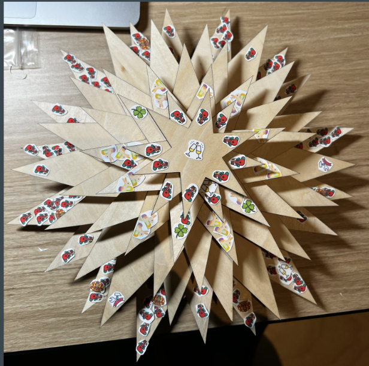

## Reflection and Insights Grained From Experience

Three months ago, Digital Humanities was not a course of study that I was familiar with. I did not have a lot of expectations coming into the class. I thought the class would use some text mining and other techniques to retrieve and analyze data from text. I don't know why I thought the class would cover this. I inferred that the class would be focused on digitizing data after processing it based on the title. The class met some of my expectations as we learned new methods of visualizing and digitizing data. Before taking the class, I did not have experience with or thought of using 3D printing and scanning, embroidery, or fabrication as a way to visualize data. Throughout, the class we were exposed to a wide variety of DH projects that utilized different methods for data visualization. This was my first time seeing projects of this type and it allowed me to think about the ethics around displaying information about individuals who do not have a say in how they are being represented in a project. This was something that was brought up in the discussion of a website that we had seen that displayed images of incarcerated individuals in a DH project to which the prisoners had no relationship. I was pleased to hear a student bring up this point as it is not something I had considered to be of ethical concern when I had looked at the website myself. This forced me to make more ethical considerations as I went through the course. As a result, I found myself working hard to accurately represent incarcerated individuals in my Printing in prison project as accurately as possible by analyzing the dataset and doing detailed research before deciding to place something in my project. For example: In the project, I could not find any accurate information of an individual known as the Rabbi. In an attempt to preserve their identity in the best way possible. Instead of making inferences about their life, I talked more about their career as an umpire for which there was alot of information.

I also had not previously considered that projects on the internet could have an intended audience and explicitly say so on the website. This was seen in the [Unmapping the Caribbean: Sanctuary and Sound](https://nyuds.maps.arcgis.com/apps/MapSeries/index.html?appid=489f1aee6b324a75b709d5d37f0cea2a) Digital Humanities project that we reviewed in class. This project explicitly stated that it was intended for individuals rooted in the Caribbean and their allies. Users were encouraged not to proceed if they did not meet this criteria. The project went on to display audio clips that said "This map is for you" in different Caribbean dialects. At first, I did not understand the logic of this even as a native speaker of Patois, one of the dialects that was being displayed on the page. However, after some thought, I realized that there could be some valid reason why there was an intended audience. This could include that the author wanted their work to be interacted with by people who are connected to the work. Thus, they will have a stronger sense of appreciation when they engage with the project. It could also mean that they did not want these dialects to be mimicked or ridiculed in a way that is offensive to native speakers. Explaining DH projects such as the Unmapping of the Caribbean made me realize that even though I am not interested in working in the Digital Humanities space, I have a new appreciation for these projects and enjoy exploring the data that they present. I did not think that I was the type of person to be interested in exploring data but the creative methods of data visualization that are often used have drawn me to explore these projects more. I also learned that minimal computing is very useful and I plan to use it more in the future for my smaller projects. I had worked with mardown fliles and Jekyll before coming into the class but not with any personal projects. I did not use it in a creative sense as was done in this class. Working with the Jekyll templates has made me realize that this is much more useful than spending time on creating a static website with HTML and CSS. My new experience with these libraries will allow me to take less time working on smaller informational projects as I can plug and chug with the provided templates as done for this assignment.

Throughout the course, I had the opportunity to work on two projects. For each project, I tried to tell a story with my work. For the [printing in prisons project](https://printinginprisons.org/blog/williams-s/), I tried to depict a picture of what it looked like to be an incarcerated individual at Eastern State Penitentiary who had the opportunity to participate in baseball games and express yourself creatively in the prison newsletter, *The Umpire*. I believe I did a good job at doing this as I was able to capture the voice of Jingles,a prominent inmate in my report by showing his life history and origins as a bookkeeper and drawing a parallel between the skills he had outside of prison and how he transferred and utilized them to make meaningful contributions to *The Umpire* through Poetry. For this project, I wish I could have had more time to dedicate to building my page so it had more of an interactive element. I have the background skills to do so and would have learned a lot while researching to do this. This would have made my project more meaningful and allow me to utilize the digital data visualization elements that we saw in the different Digital Humanities Projects looked at in the course. If I could redo the project to include this, I would have opted to have some audio embeddings of some of the poems that were written in the umpire or maybe categorized the poem based on themes that the user could interact with by clicking around a map of related concepts on a webpage. Similarly, in the Education Commons Project, my team and I did a good job of coming up with a dataset that we wanted to represent. We created a Christmas tree that showcased the frequency of holiday mentions during each month of the year. If I could redo this project, my only change would be the material that was used. I think wood does not evoke the same emotions from someone as a toy or teddy bear or stuffed tree-shaped toy does. Given that the purpose of our project was to try to get users to feel a sense of compassion for the inmate through shared experiences, I believe a tree-shaped stuffed toy would create a more relatable Christmas feel via its softness and resemblance to something you would be gifted as a child. Here is a photo of the final results of this project: 

These projects allowed me to think about several themes covered in the class. We digitized prison record data through the Printing in Prisons Project and this ties back to our discussion of archiving data and different methods that could be used to do this. We spoke of digitizing data that could be otherwise lost or degraded. One example that comes to mind is the microfiches that the Penn Library has that are being degraded. Digitization is one way that we learned that this data could be archived and prevented from being lost forever. Through our projects, we also had the opportunity to embed images into our webpage. This ties back to our discussion of metadata where we went through an exercise of building metadata to images using meaningful tags. We had an opportunity to do this once again while creating alternate text for the images in our project. We also explored this through the printing in-prison exercise where we took some pages of the newsletter and generated metadata for each chapter. Our trip to the Van-Pelt basement, where we saw the process of digitizing books contributed to my learning as I was able to hear about some of the challenges with digitizing data. For example, We discussed that a textured book of materials made from plants would be difficult to digitize as it is not possible to digitally represent the textures of the book. We also saw an anatomy book that was similar to a flip book and had a level of interactivity that could not be replicated if the book were to be digitized. The demonstration showing a breached baby etc would also not be as clear when digitized. Books such as this one were probably not mass-produced. We learned that other methods had to be taken to preserve them as digitization was not very useful in this case. In a case such as this, we discussed that it is best to handle the book with care and have professionals replenish it from time to time with different book preservation strategies.

The theme of preservation of data through digitization has persisted throughout the class. However, looking back to the first two weeks of the class I now see how the theme of data preservation could be applied to the [Big Tech Won’t Revitalize Indigenous Languages](https://techwontsave.us/episode/177_big_tech_wont_revitalize_indigenous_languages_w_keoni_mahelona) podcast that we discussed in class. This podcast speaks on how indigenous languages have been stripped away from their speakers through colonization. It discussed how smaller groups now speak the languages and to sustain the language and make technology accessible to those who speak these languages, companies such as Microsoft have begun to train large language models to sell their products with these language options. These large companies have a lot of money to spend on these projects and have no vested interest in the language. Therefore, they are not making any effort to ensure that their products authentically use the language. It could be said that these companies are helping with the preservation of this indigenous language but at what cost? The podcast also raises the issue that this takes revenue away from smaller companies that are doing the necessary work to maintain the language in its most authentic form using data models. This opens another caveat to data preservation as when thinking about digitizing data we must consider the people being represented and whether they are being represented authentically. This also ties back to the theme of ownership which we discussed when talking about copyright laws. When we create our work we must consider who we want to access our work. Even something as simple as this digital portfolio through GitHub can be copywritten. This is something that I was unaware of and had not considered. I will consider this more when using GitHub in the future as it is a website that is primarily used for cloning and forking data.

Learn more about how I will apply what I have learned in future studies or life: 
- [Looking Forward after this experience](looking_forward.html)

